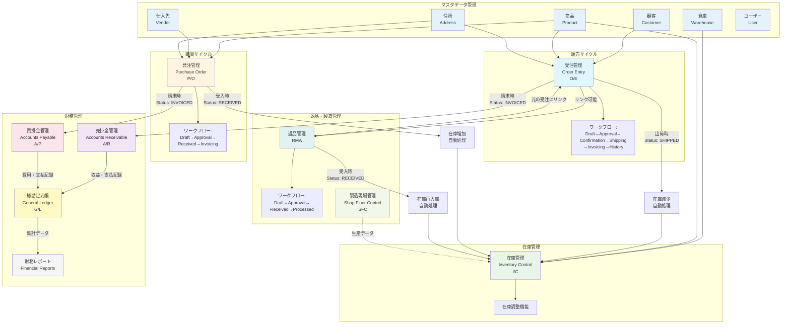
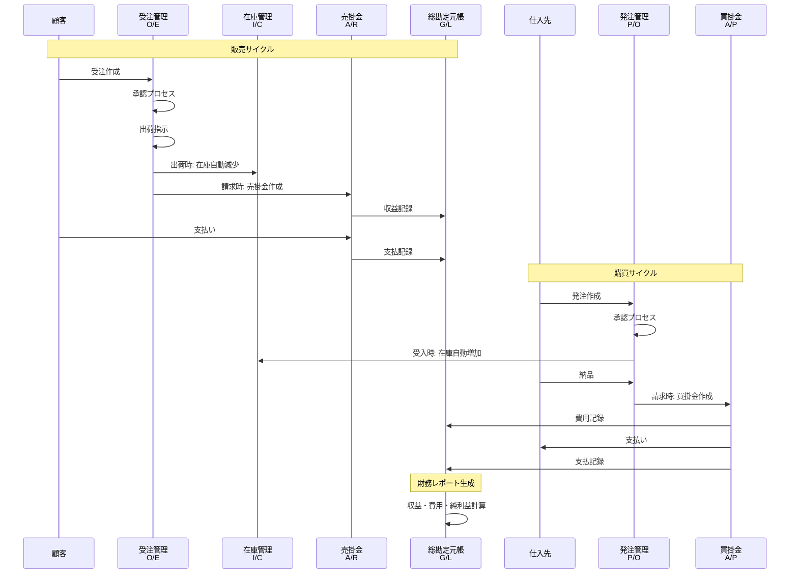
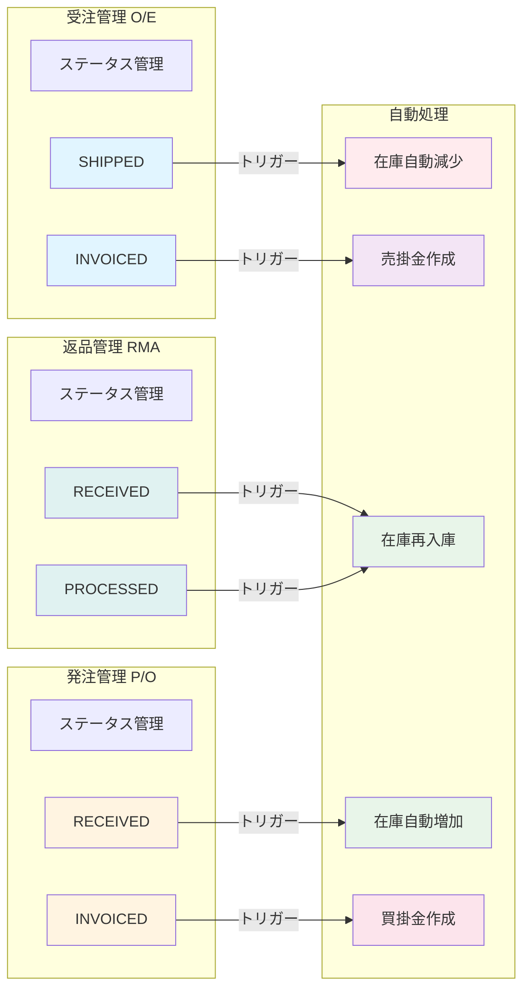
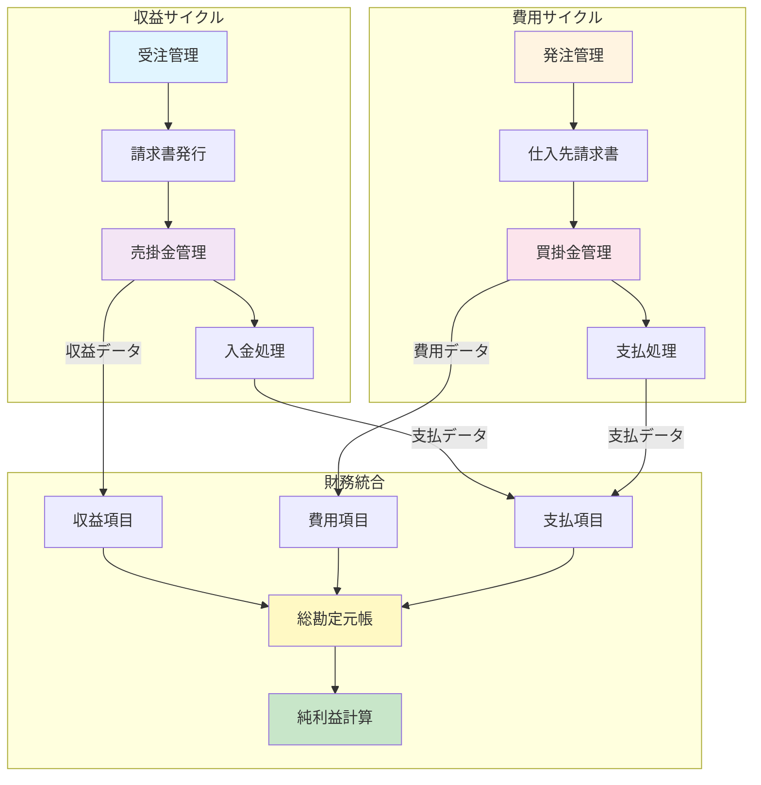
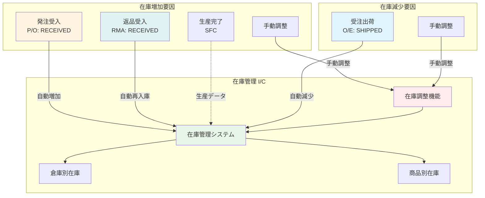
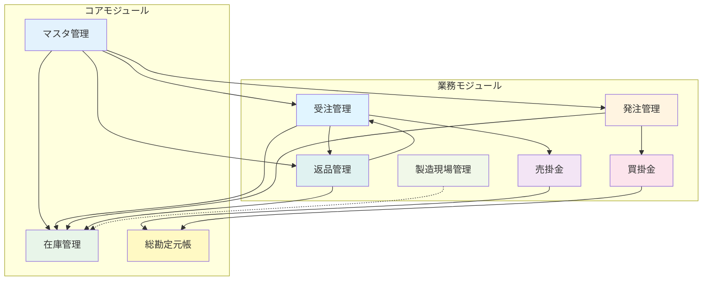
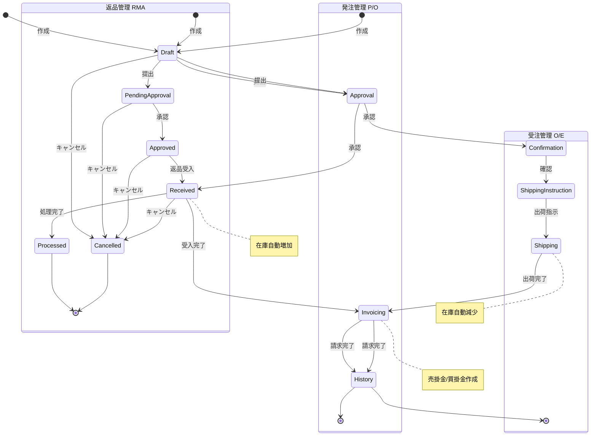

# ERPシステム 主要モジュール関連図

## システム全体アーキテクチャ図

## データフロー詳細図

## モジュール間の自動処理トリガー

## 財務統合フロー

## 在庫管理統合フロー

## モジュール依存関係マップ

## ワークフロー状態遷移図

## モジュール一覧表

| モジュール | 略称 | 主要機能 | 自動処理トリガー |
|----------|------|---------|----------------|
| **受注管理** | O/E | 顧客受注の全ライフサイクル管理 | SHIPPED → 在庫減少 INVOICED → 売掛金作成 |
| **発注管理** | P/O | 仕入先発注の全ライフサイクル管理 | RECEIVED → 在庫増加 INVOICED → 買掛金作成 |
| **在庫管理** | I/C | 倉庫別・商品別在庫追跡・調整 | 受注・発注・RMAから自動更新 |
| **売掛金管理** | A/R | 顧客請求書・入金管理 | 受注請求時自動作成 |
| **買掛金管理** | A/P | 仕入先請求書・支払管理 | 発注請求時自動作成 |
| **総勘定元帳** | G/L | 全財務取引の集約・レポート | 売掛金・買掛金から自動集計 |
| **返品管理** | RMA | 顧客返品の承認・処理 | RECEIVED → 在庫再入庫 |
| **製造現場管理** | SFC | 製造・生産オペレーション管理 | 生産データ → 在庫更新 |
| **マスタ管理** | - | 顧客・商品・仕入先・倉庫等の基本データ | - |

---

**作成日**: 2024年
**システム**: ERP System (my-app)
**バージョン**: v2.3.0+

