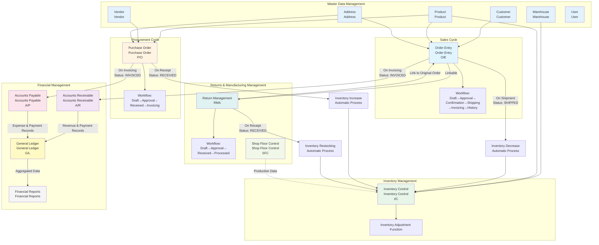
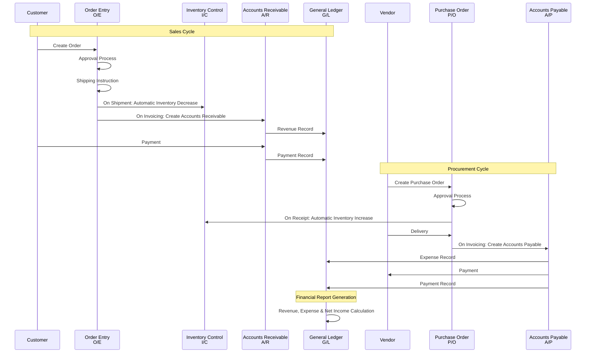
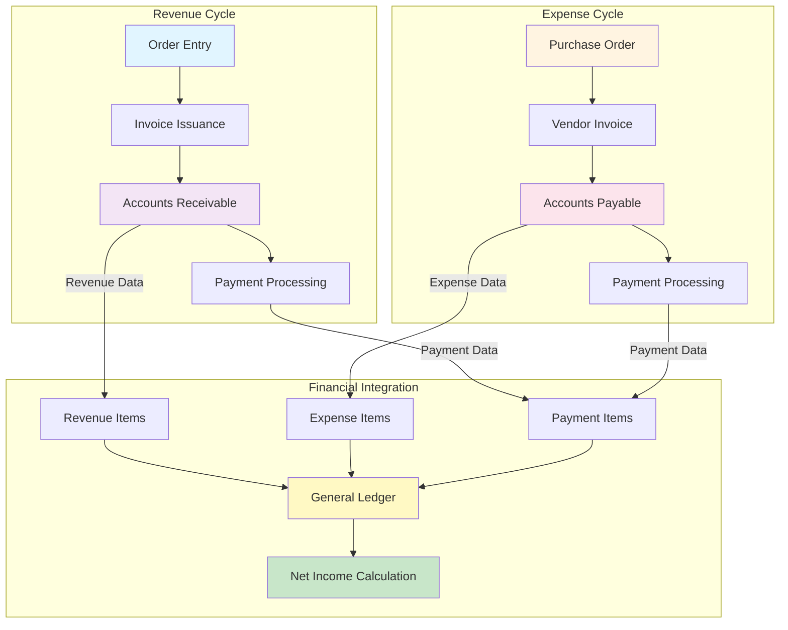
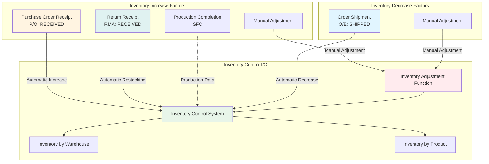
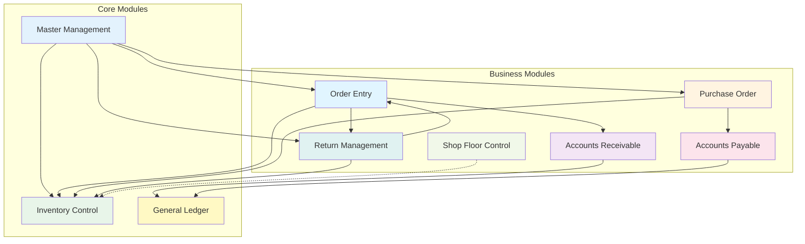
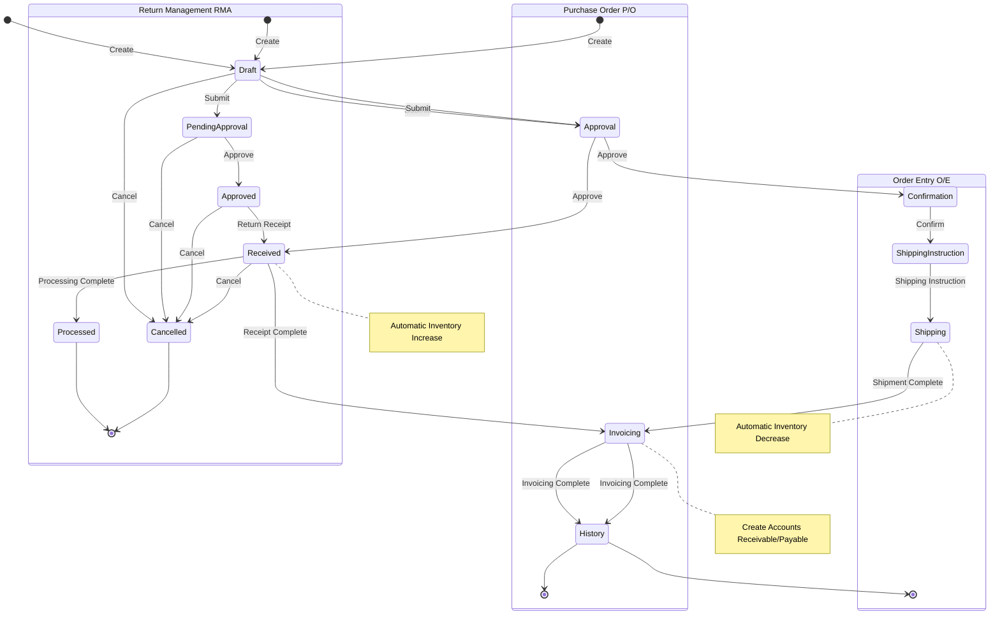

# ERP System Main Module Relationship Diagram

## Overall System Architecture Diagram

## Data Flow Detail Diagram

## Automatic Process Triggers Between Modules

```mermaid
graph LR
    subgraph "Order Entry O/E"
        OE_Status[Status Management]
        OE_SHIPPED[SHIPPED]
        OE_INVOICED[INVOICED]
    end

    subgraph "Purchase Order P/O"
        PO_Status[Status Management]
        PO_RECEIVED[RECEIVED]
        PO_INVOICED[INVOICED]
    end

    subgraph "Return Management RMA"
        RMA_Status[Status Management]
        RMA_RECEIVED[RECEIVED]
        RMA_PROCESSED[PROCESSED]
    end

    subgraph "Automatic Processes"
        Auto_IC_Dec[Automatic Inventory Decrease]
        Auto_IC_Inc[Automatic Inventory Increase]
        Auto_IC_Restock[Inventory Restocking]
        Auto_AR[Create Accounts Receivable]
        Auto_AP[Create Accounts Payable]
    end

    OE_SHIPPED -->|Trigger| Auto_IC_Dec
    OE_INVOICED -->|Trigger| Auto_AR
    PO_RECEIVED -->|Trigger| Auto_IC_Inc
    PO_INVOICED -->|Trigger| Auto_AP
    RMA_RECEIVED -->|Trigger| Auto_IC_Restock
    RMA_PROCESSED -->|Trigger| Auto_IC_Restock

    style OE_SHIPPED fill:#e1f5ff
    style OE_INVOICED fill:#e1f5ff
    style PO_RECEIVED fill:#fff4e1
    style PO_INVOICED fill:#fff4e1
    style RMA_RECEIVED fill:#e0f2f1
    style RMA_PROCESSED fill:#e0f2f1
    style Auto_IC_Dec fill:#ffebee
    style Auto_IC_Inc fill:#e8f5e9
    style Auto_IC_Restock fill:#e8f5e9
    style Auto_AR fill:#f3e5f5
    style Auto_AP fill:#fce4ec
```

## Financial Integration Flow

## Inventory Management Integration Flow

## Module Dependency Map

## Workflow State Transition Diagram

## Module List Table

| Module | Abbreviation | Main Functions | Automatic Process Triggers |
|--------|-------------|----------------|---------------------------|
| **Order Entry** | O/E | Full lifecycle management of customer orders | SHIPPED → Inventory Decrease INVOICED → Create Accounts Receivable |
| **Purchase Order** | P/O | Full lifecycle management of vendor orders | RECEIVED → Inventory Increase INVOICED → Create Accounts Payable |
| **Inventory Control** | I/C | Warehouse and product-based inventory tracking and adjustment | Auto-update from Orders, Purchase Orders, and RMA |
| **Accounts Receivable** | A/R | Customer invoice and payment management | Auto-created on order invoicing |
| **Accounts Payable** | A/P | Vendor invoice and payment management | Auto-created on purchase order invoicing |
| **General Ledger** | G/L | Aggregation and reporting of all financial transactions | Auto-aggregation from Accounts Receivable and Payable |
| **Return Management** | RMA | Approval and processing of customer returns | RECEIVED → Inventory Restocking |
| **Shop Floor Control** | SFC | Manufacturing and production operations management | Production Data → Inventory Update |
| **Master Management** | - | Basic data for customers, products, vendors, warehouses, etc. | - |

---

**Created**: 2024
**System**: ERP System (my-app)
**Version**: v2.3.0+
