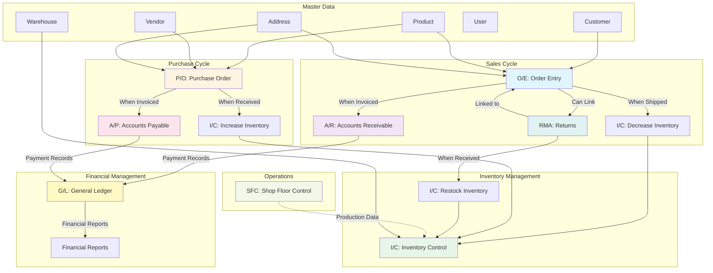

# ERP System

A full-stack Enterprise Resource Planning (ERP) system built with Spring Boot backend and React frontend, featuring comprehensive business management capabilities including user management, customer management, product catalog, address management, and order processing with multi-step workflows.

## 🏗️ Architecture

This project follows a client-server architecture:

- **Backend**: Spring Boot 3.4.0 REST API with JSON file-based database
- **Frontend**: React 18.2.0 monorepo with TypeScript, styled-components, and a comprehensive UI component library
- **Communication**: RESTful APIs and WebSocket for real-time updates

## 📁 Project Structure

```
app-erp/
├── server/              # Spring Boot backend application
│   ├── src/            # Java source code
│   ├── data/           # JSON database files
│   ├── build.gradle    # Gradle build configuration
│   └── README.md       # Backend documentation
│
└── client/             # React frontend monorepo
    ├── apps/
    │   ├── my-app/     # Main ERP application
    │   ├── my-dev/     # Component showcase/demo app
    │   └── my-electron/# Electron desktop wrapper
    ├── libs/
    │   └── ui/         # Shared UI component library
    └── README.md       # Frontend documentation
```

## 🚀 Quick Start

### Prerequisites

- **Java 17+** (for backend)
- **Node.js 18+** (for frontend)
- **pnpm** (install with `npm install -g pnpm`)

### Starting the Application

1. **Start the Backend Server**

   ```bash
   cd server
   ./gradlew bootRun
   ```

   The backend API will be available at `http://localhost:8080`

2. **Start the Frontend Application**

   ```bash
   cd client
   pnpm install
   pnpm dev:my-app
   ```

   The frontend application will be available at `http://localhost:5173` (or the next available port)

3. **Initial Setup**

   - On first launch, you'll be prompted to create the first admin user
   - After setup, you can log in with your credentials
   - The system will guide you through the initial configuration

## 📚 Documentation

For detailed documentation, please refer to:

- **[Backend Documentation](server/README.md)** - Spring Boot API, endpoints, data models, and configuration
- **[Frontend Documentation](client/README.md)** - React applications, UI components, and development guide

## ✨ Features

### Core Functionality

- ✅ **User Management**: Authentication, user CRUD operations, role-based access
- ✅ **Customer Management**: Complete customer lifecycle management
- ✅ **Product Catalog**: Product management with pricing and inventory tracking
- ✅ **Address Management**: Customer address storage and association
- ✅ **Order Management**: Full order lifecycle with multi-step workflow
  - Draft → Approval → Confirmation → Shipping Instructions → Shipping → Invoicing → Payment → History

### Technical Features

- 🌐 **Internationalization**: English and Japanese language support
- 🎨 **Dark Mode**: Built-in light/dark theme switching
- 🔄 **Real-time Updates**: WebSocket integration for live data synchronization
- 📱 **Responsive Design**: Mobile and tablet support
- 🎯 **Type Safety**: Full TypeScript coverage
- 🧩 **Component Library**: Reusable UI components with design tokens
- 💾 **File-based Database**: JSON file storage for easy data management

## 🔗 Module Relationships

The ERP system consists of multiple integrated modules that work together to manage the complete business cycle. Below is an overview of the main modules and how they interact:

### Module Abbreviations

- **O/E** - Order Entry (Customer Orders)
- **P/O** - Purchase Order (Supplier Orders)
- **I/C** - Inventory Control
- **A/R** - Accounts Receivable
- **A/P** - Accounts Payable
- **G/L** - General Ledger
- **RMA** - Return Merchandise Authorization
- **SFC** - Shop Floor Control

### Module Flow Diagram



### Module Descriptions

#### Order Entry (O/E)
- **Purpose**: Manages customer sales orders from creation to fulfillment
- **Workflow**: Draft → Approval → Confirmation → Shipping Instructions → Shipping → Invoicing → History
- **Key Relationships**:
  - **Inventory Control**: Automatically decreases inventory when order status changes to "SHIPPED"
  - **Accounts Receivable**: Creates receivable entries when order is invoiced
  - **RMA**: Can be linked to return merchandise authorizations
  - **Master Data**: Uses Customers, Products, and Addresses

#### Purchase Order (P/O)
- **Purpose**: Manages supplier purchase orders and procurement
- **Workflow**: Draft → Approval → Received → Invoicing → History
- **Key Relationships**:
  - **Inventory Control**: Automatically increases inventory when PO status changes to "RECEIVED"
  - **Accounts Payable**: Creates payable entries when supplier invoice is received
  - **Master Data**: Uses Vendors, Products, and Addresses

#### Inventory Control (I/C)
- **Purpose**: Tracks inventory levels across warehouses
- **Key Relationships**:
  - **Order Entry**: Receives inventory decrease transactions when orders are shipped
  - **Purchase Order**: Receives inventory increase transactions when POs are received
  - **RMA**: Receives inventory restock transactions when returned items are received
  - **Master Data**: Uses Products and Warehouses

#### Accounts Receivable (A/R)
- **Purpose**: Manages customer invoices and payment tracking
- **Key Relationships**:
  - **Order Entry**: Receives invoice data when orders are invoiced
  - **General Ledger**: Provides revenue and payment data for financial reporting

#### Accounts Payable (A/P)
- **Purpose**: Manages supplier invoices and payment tracking
- **Key Relationships**:
  - **Purchase Order**: Receives invoice data when supplier invoices are received
  - **General Ledger**: Provides expense and payment data for financial reporting

#### General Ledger (G/L)
- **Purpose**: Central financial repository aggregating all financial transactions
- **Key Relationships**:
  - **Accounts Receivable**: Receives revenue and payment transactions
  - **Accounts Payable**: Receives expense and payment transactions
  - **Output**: Generates financial reports showing revenue, costs, and net income

#### Return Merchandise Authorization (RMA)
- **Purpose**: Manages product returns from customers
- **Workflow**: Draft → Approval → Received → Processed
- **Key Relationships**:
  - **Order Entry**: Linked to original customer orders
  - **Inventory Control**: Automatically restocks inventory when RMA status changes to "RECEIVED"
  - **Master Data**: Uses Customers and Products

#### Shop Floor Control (SFC)
- **Purpose**: Manages manufacturing and production operations
- **Key Relationships**:
  - **Inventory Control**: Can update inventory based on production data

### Data Flow Summary

1. **Sales Flow**: Customer Order (O/E) → Ship → Decrease Inventory (I/C) → Invoice → Accounts Receivable (A/R) → General Ledger (G/L)
2. **Purchase Flow**: Purchase Order (P/O) → Receive → Increase Inventory (I/C) → Invoice → Accounts Payable (A/P) → General Ledger (G/L)
3. **Return Flow**: RMA → Receive → Restock Inventory (I/C)
4. **Financial Flow**: A/R + A/P → General Ledger → Financial Reports

## 🛠️ Technology Stack

### Backend
- Spring Boot 3.4.0
- Spring Web (REST API)
- Spring WebSocket
- Spring Data JPA
- JSON file-based database
- Java 17
- Gradle

### Frontend
- React 18.2.0
- TypeScript 5.0.0
- Styled Components 6.1.0
- Vite 5.0.0
- Nx 22.0.3 (monorepo)
- pnpm (package manager)
- Electron (desktop app)

## 📖 API Overview

The backend provides RESTful APIs for all entities:

- `GET/POST/PUT/DELETE /api/users` - User management
- `GET/POST/PUT/DELETE /api/customers` - Customer management
- `GET/POST/PUT/DELETE /api/products` - Product management
- `GET/POST/PUT/DELETE /api/addresses` - Address management
- `GET/POST/PUT/DELETE /api/orders` - Order management
- `PUT /api/orders/{id}/status` - Order status updates
- `POST /api/users/login` - User authentication

For complete API documentation, see [server/README.md](server/README.md).

## 🗂️ Data Storage

The application uses JSON file-based storage located in `server/data/`:

- `users.json` - User data
- `customers.json` - Customer data
- `products.json` - Product catalog
- `addresses.json` - Address data
- `orders.json` - Order records
- `order_counter.json` - Order ID counter

Data is automatically saved on changes when `jsondb.auto.save=true` is configured.

## 🧪 Development

### Backend Development

```bash
cd server
./gradlew bootRun          # Start development server
./gradlew test             # Run tests
./gradlew build            # Build application
```

### Frontend Development

```bash
cd client
pnpm install               # Install dependencies
pnpm dev:my-app           # Start main app
pnpm dev:my-dev           # Start demo app
pnpm build                # Build all applications
pnpm type-check           # TypeScript type checking
pnpm lint                 # Lint code
```

### Running Both Together

You can use the startup script (if available):

```bash
./server/start-apps.sh
```

Or manually start both in separate terminals.

## 🐛 Troubleshooting

### Port Conflicts

**Backend (port 8080):**
```bash
lsof -ti:8080 | xargs kill -9
```

**Frontend (port 5173 or similar):**
```bash
lsof -ti:5173 | xargs kill -9
# Or use the client command:
cd client
pnpm clean:port
```

### Build Issues

**Clean and rebuild:**
```bash
# Frontend
cd client
pnpm clean
pnpm install
pnpm build

# Backend
cd server
./gradlew clean build
```

### Data Issues

- Check that JSON files in `server/data/` are valid JSON
- Ensure file permissions allow read/write access
- Check application logs for detailed error messages

For more troubleshooting tips, see the [server README](server/README.md) and [client README](client/README.md).

## 📝 License

This project is published under the MIT License.

## 🤝 Contributing

Please report bugs and feature requests through GitHub Issues.

## 📄 Version History

- **v2.3.0**: WebSocket support and internationalization
- **v2.2.0**: Order management with multi-step workflow
- **v2.1.0**: Customer, Product, and Address management
- **v2.0.0**: Migration from Angular to React with styled-components UI library
- **v1.3.0**: Enhanced error handling
- **v1.2.0**: Improved Japanese support
- **v1.1.0**: Migration from H2 to JSONDB
- **v1.0.0**: Initial release (User Management System)

---

For detailed information about specific components, please refer to the documentation in the `server/` and `client/` directories.

