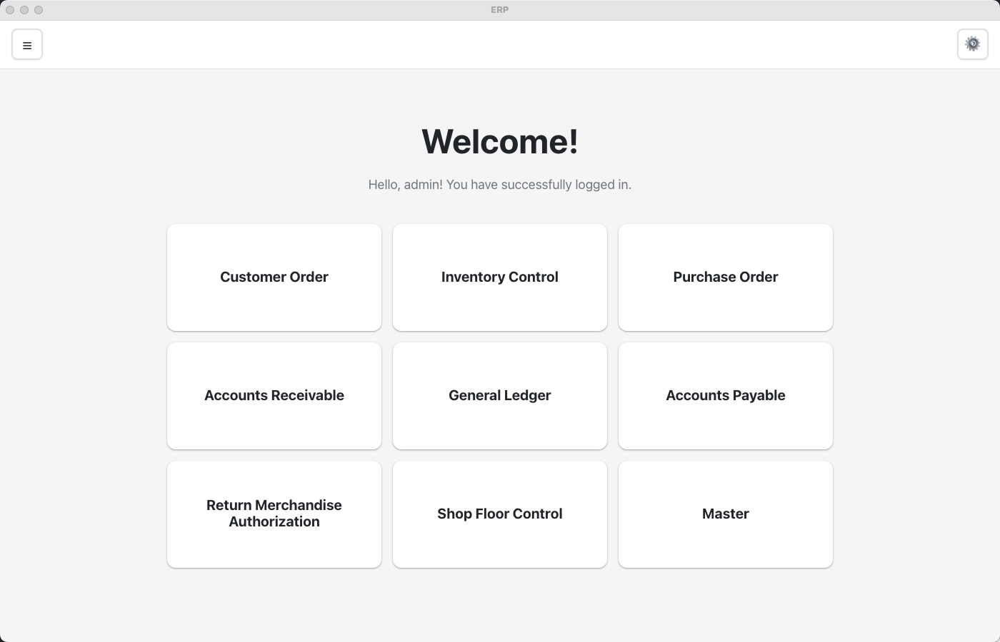

# ERP System Screenshots

This document contains screenshots of the ERP system interface, showcasing various modules and features.

## Welcome Screen

The welcome screen provides an overview of the ERP system and serves as the entry point for users.

## Order Entry Module

The Order Entry module allows users to create and manage customer orders through a multi-step workflow:
- Draft → Approval → Confirmation → Shipping Instructions → Shipping → Invoicing → Payment → History

## General Ledger Module

The General Ledger module provides comprehensive financial reporting and transaction tracking, aggregating data from Accounts Receivable and Accounts Payable modules.

---

**Note**: These screenshots are captured from the production ERP application and demonstrate the user interface and workflow of various system modules.

